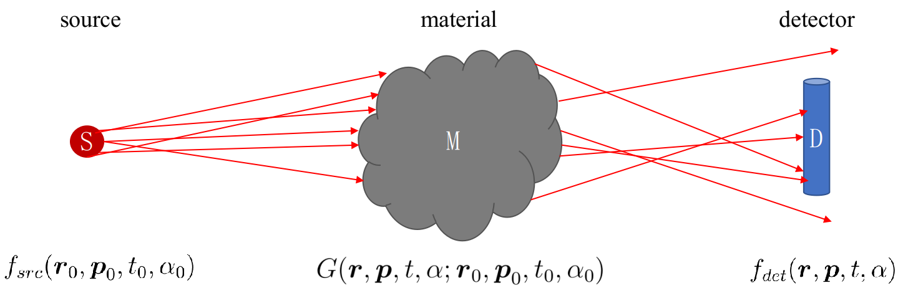

Theory
===================================

Monte Carlo simulation
----------------------------

   A simplified sketch of particle transport

Some particles originated
from the source interact with the material and evatrually detected by the detector.
The probability of detection then can be expressed as

.. math::

  f_{det}(\boldsymbol{r}, \boldsymbol{p}, t, \alpha)= \int {\mathop{}\!\mathrm{d}}^3
  \boldsymbol{r}_0 \int {\mathop{}\!\mathrm{d}}^3 \boldsymbol{p}_0 \int {\mathop{}\!\mathrm{d}} t_0
  \int {\mathop{}\!\mathrm{d}} \alpha_0 \,\,
  G(\boldsymbol{r}, \boldsymbol{p}, t, \alpha; \boldsymbol{r}_0, \boldsymbol{p}_0, t_0, \alpha_0) f_{src}(\boldsymbol{r}_0, \boldsymbol{p}_0, t_0, \alpha_0)

where :math:`\boldsymbol{r}` is the position, :math:`\boldsymbol{p}_0` is the
momentum, :math:`t` is the time, :math:`\alpha` is the spin, and :math:`\textbf{$G$}` function is the propagator.

Neutron scattering
---------------------

.. math::

  \Gamma(t) = \frac{\hbar}{m} \int_0^{\infty} \mathrm{d}\omega \frac{\rho(\omega)}{\omega}
  \left[\coth\left(\frac{\hbar \omega}{2k_B T}\right)
  (1-\cos {\omega t})-i \sin{\omega t}\right]
